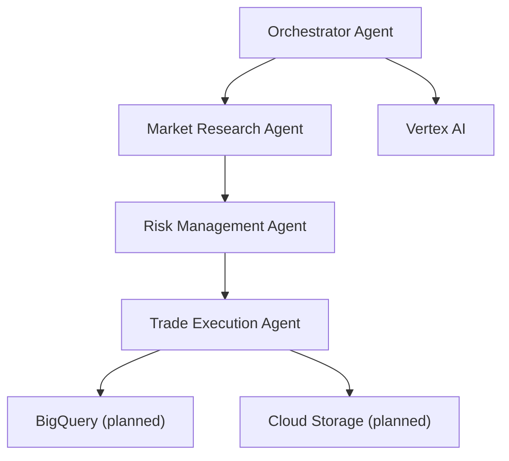

# Multi-Agent Autonomous Trading System

## Overview
This project is a multi-agent autonomous trading system built with the Agent Development Kit (ADK) and Google Cloud. It demonstrates advanced orchestration between specialized AI agents to automate the end-to-end process of market research, risk management, and trade execution.

## Key Features
- **Multi-agent orchestration:** Distinct agents for research, risk, and trading, coordinated by an orchestrator agent.
- **Autonomous workflows:** Agents collaborate to analyze markets, evaluate risk, and execute trades with minimal human intervention.
- **Google Cloud integration:** Ready for deployment on Vertex AI Agent Engine, with planned support for BigQuery and Cloud Storage.
- **Extensible architecture:** Easily add new agents (e.g., reporting, compliance) or integrate additional data sources and tools.

## Agent Architecture

### 1. Market Research Agent
- **Role:** Scans the market for opportunities using Finviz and Yahoo Finance.
- **Tools:** Stock screeners, fundamental/valuation/financial metrics, high-volume stock detection, price lookups.
- **Workflow:** Generates trade ideas based on market data and portfolio context.

### 2. Risk Management Agent
- **Role:** Evaluates proposed trades for risk and compliance.
- **Tools:**
  - `check_position_size`: Ensures no trade exceeds a configurable percentage of portfolio value.
  - `check_volatility`: Rejects trades with excessive volatility.
- **Workflow:** Approves, rejects, or suggests modifications to trade ideas before execution.

### 3. Trade Execution Agent
- **Role:** Executes approved trades and manages orders via the Alpaca API.
- **Tools:** Position management, order placement, options data, corporate actions, historical data, volatility calculations.
- **Workflow:** Places, modifies, or cancels trades as instructed by the orchestrator.

### 4. Orchestrator Agent (Root Agent)
- **Role:** Coordinates the entire workflow.
- **Workflow:**
  1. Delegates market research to the research agent.
  2. Passes trade ideas to the risk agent for evaluation.
  3. Sends approved trades to the trade execution agent.
  4. (Planned) Logs actions and generates reports via a reporting agent.

## Example Workflow
1. **Market Research Agent** identifies high-potential stocks.
2. **Risk Management Agent** checks each idea for position size and volatility constraints.
3. **Trade Execution Agent** places trades for ideas that pass risk checks.
4. **Orchestrator Agent** manages the flow and ensures each step is completed in sequence.

## Google Cloud Integration
- **Vertex AI Agent Engine:** Deploy agents for scalable, managed inference.
- **BigQuery (planned):** Store and analyze trade logs, research results, and agent decisions.
- **Cloud Storage (planned):** Store generated reports and logs.
- **Pub/Sub (optional):** Enable event-driven workflows and agent triggers.

## Setup & Deployment
1. **Install dependencies:**
   ```bash
   pip install -r requirements.txt
   ```
2. **Configure Google Cloud:**
   - Set your GCP project ID and bucket in `deploy_to_vertex.py`.
   - Ensure you have credentials for Vertex AI, BigQuery, and Cloud Storage.
3. **Set Alpaca and other API keys as environment variables.**
4. **Deploy to Vertex AI:**
   ```bash
   python multi_tool_agent/deploy_to_vertex.py
   ```

## Extending the System
- **Add new agents:** Create new tools and register them in `agent.py`.
- **Integrate more data sources:** Add tools for additional APIs or databases.
- **Enhance reporting:** Implement a reporting agent to log actions and generate summaries in BigQuery/Cloud Storage.
- **Build a dashboard:** Visualize agent actions, portfolio, and logs for transparency and demo impact.

## Architecture Diagram


## Hackathon Highlights
- **True multi-agent collaboration:** Agents negotiate and make decisions together, not just sequentially.
- **Cloud-native:** Designed for Google Cloud scalability and integration.
- **Transparency:** Every decision is logged and explainable.
- **Extensible:** Easily add new agents, tools, and data sources.

## Learnings
- Multi-agent systems enable modular, scalable, and explainable automation for complex workflows.
- Google Cloud services (Vertex AI, BigQuery, Cloud Storage) provide the foundation for robust, production-ready AI systems.

---

**For questions or demo requests, please contact the project team!** 